# RubyStore (Admin)

RubyStore Admin is the central management dashboard of the RubyStore e-commerce platform, empowering administrators and staff to efficiently manage all core operations — including users, staffs, products, categories, orders, reviews, blogs, vouchers, and real-time interactions across the system.
It supports a full range of core features including:

-   **Login** – secure sign-in with JWT authentication
-   **Dashboard Analytics** – monitor revenue, users, and product performance
-   **Slide Management** – add, update, delete slider
-   **User Management** – manage user accounts and permissions
-   **Staff Management** – manage staff accounts and permissions
-   **Product Management** – add, update, or delete products with image uploads
-   **Category Management** - organize categories, sub categories, third sub categories effectively
-   **Order Management** – view and update order status in real-time
-   **Voucher Management** – create and apply discount codes
-   **Blog Management** – create, update, and delete blog article
-   **Review Management** – view and reply to customer reviews in real-time
-   **Notifications** – receive real-time order and user activity updates such as orders, reviews
-   **Messaging System** – communicate with customers directly

This repository contains the frontend codebase built with React and other modern technologies.

Check out: [RubyStore (Server)](https://github.com/SoulMinT05/rubystore-backend)

## Example Screenshots

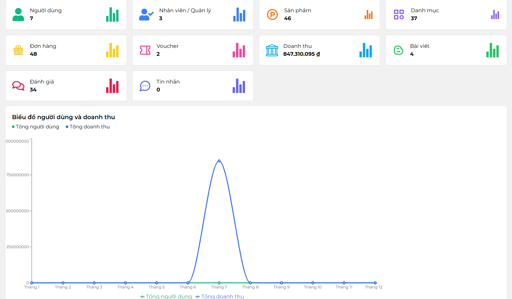

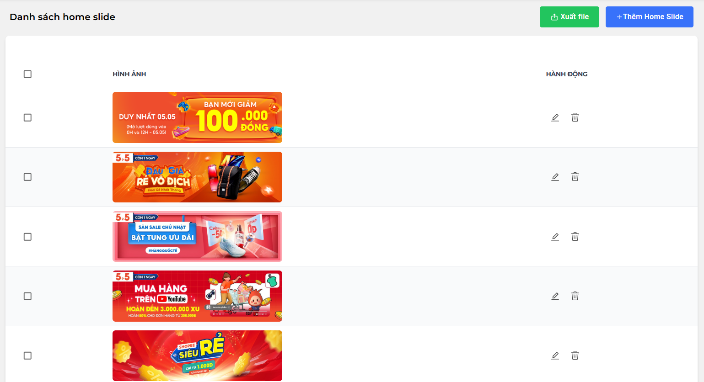

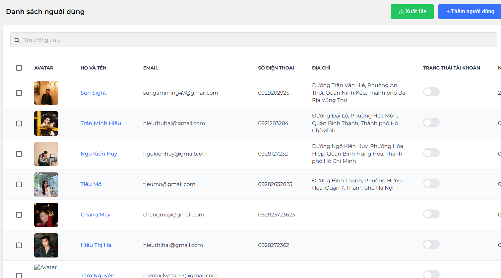

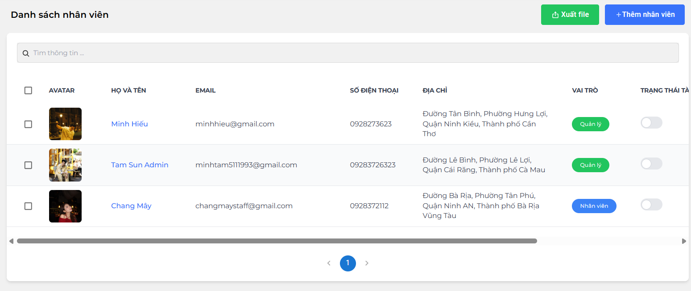

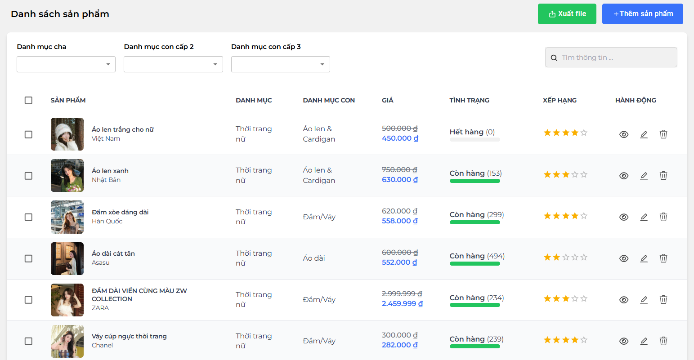

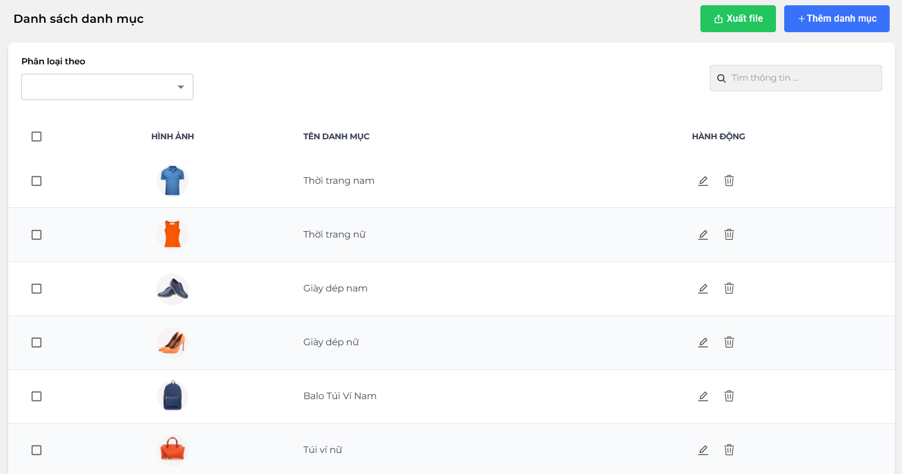

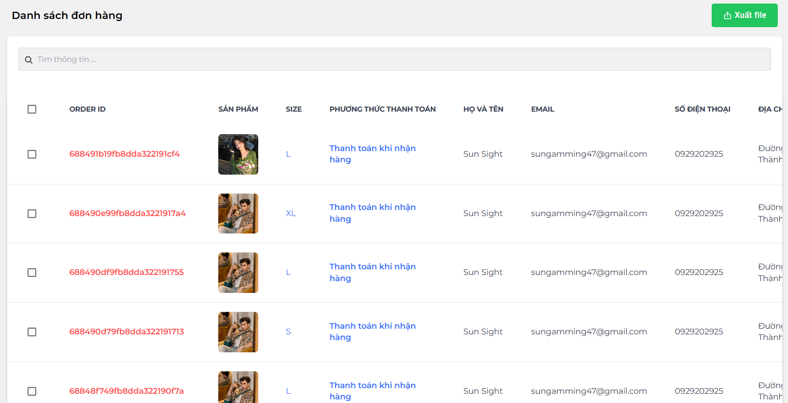

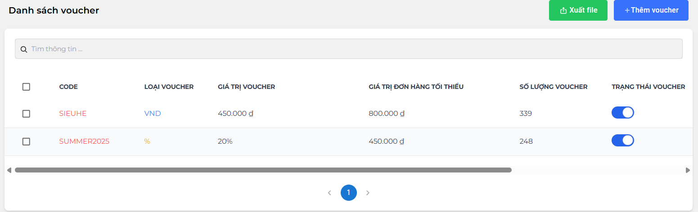

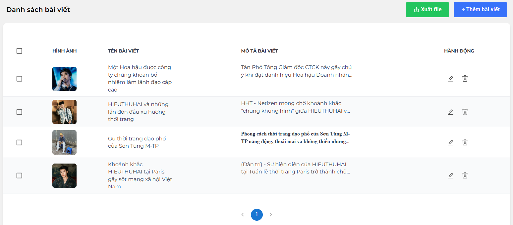

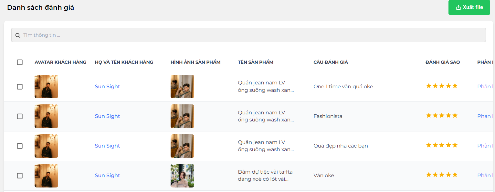

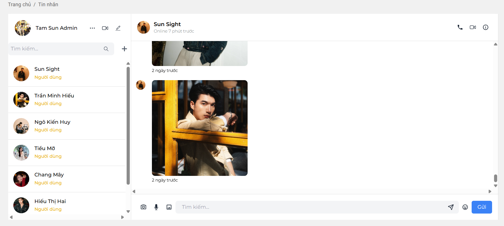

## Tech Stack

-   **Library**: ReactJS
-   **UI Library**: Material UI
-   **State Management**: Redux Toolkit
-   **Routing**: React Router DOM
-   **Styling**: TailwindCSS, SCSS, CSS
-   **Utilities**: Axios, JS-Cookies, DayJS, xlsx
-   **Image Viewer**: react-inner-image-zoom
-   **Notification**: react-toastify
-   **Emoji**: emoji-picker-react
-   **Data Visualization**: Recharts
-   **Chat & Realtime**: socket.io-client
-   **WYSIWYG Editor**: react-simple-wysiwyg
-   **PDF/Image Export**: html2canvas, jspdf

## Getting Started

### Prerequisites

-   Node.js (v22.16 or later recommended)
-   npm or yarn package manager

### Installation

1. Clone the repository:
    ```bash
    git clone https://github.com/SoulMinT05/rubystore-admin
    ```
2. Install dependencies:
    ```bash
    npm install
    # or
    yarn install
    ```
3. Configure environment variables:

    - Copy `.env.example` to `.env`:
        ```bash
        cp .env.example .env
        ```
    - Ensure the following variables are set in `.env`, and adjust them to match your API endpoints and Cloudinary storage configuration:

        ```env
        VITE_BACKEND_URL==http://localhost:8000
        ```

### Development Server

Start the development server with:

```bash
npm run dev
# or
yarn dev
```

The app will be available at `http://localhost:5174` by default.

### Build for Production

To build the project for production:

```bash
npm run build
# or
yarn build
```

The production build files will be in the `dist` folder.

## License

This project is licensed under the MIT License. See the [LICENSE](LICENSE) file for details.
